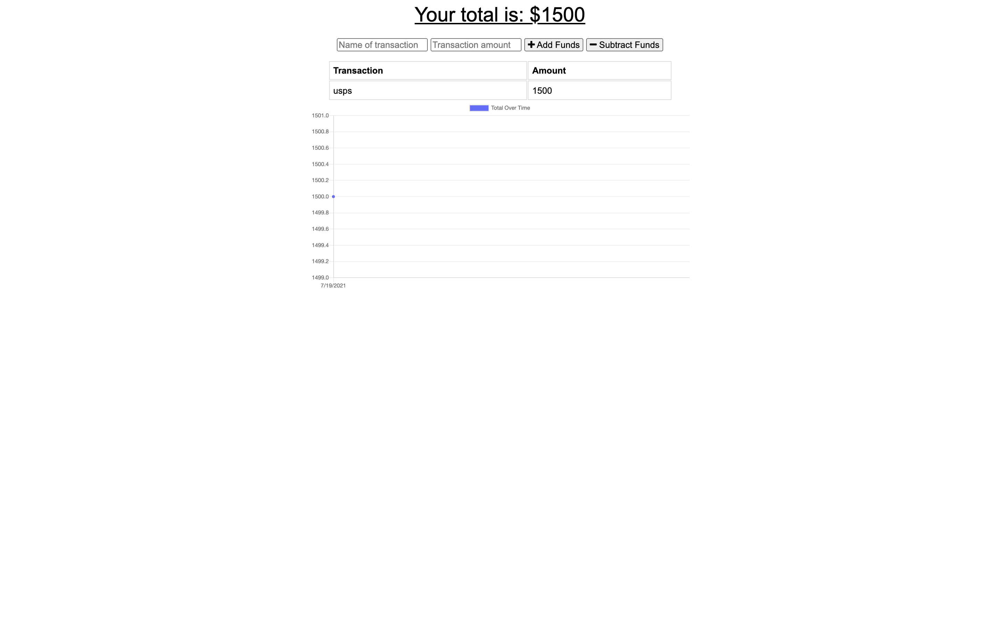

# budget-tracker

## Description
This application is to add your expenses and subtract anything you have in your budget when your online and when you are offline. when you enter transactions offline they should come up as soon as you get back online.
## Installation
 installing this app you can grabe the repo with this link https://github.com/johnbatista1223/budget-tracker you can clone the link to your local machine . in your terminal you do npm install. to run the app you just place npm run start in your terminal.
## Usage
go to this link and you can Add withdrawals and deposits.
Right click, and choose Inspect. Navigate to Application, and from there to Service Workers.
Set service worker to offline, and refresh app . add a transaction and once you put service worker online again you should still have your information.

 

## License
MIT License

Copyright (c) [2021] [john batista]

Permission is hereby granted, free of charge, to any person obtaining a copy
of this software and associated documentation files (the "Software"), to deal
in the Software without restriction, including without limitation the rights
to use, copy, modify, merge, publish, distribute, sublicense, and/or sell
copies of the Software, and to permit persons to whom the Software is
furnished to do so, subject to the following conditions:

The above copyright notice and this permission notice shall be included in all
copies or substantial portions of the Software.

THE SOFTWARE IS PROVIDED "AS IS", WITHOUT WARRANTY OF ANY KIND, EXPRESS OR
IMPLIED, INCLUDING BUT NOT LIMITED TO THE WARRANTIES OF MERCHANTABILITY,
FITNESS FOR A PARTICULAR PURPOSE AND NONINFRINGEMENT. IN NO EVENT SHALL THE
AUTHORS OR COPYRIGHT HOLDERS BE LIABLE FOR ANY CLAIM, DAMAGES OR OTHER
LIABILITY, WHETHER IN AN ACTION OF CONTRACT, TORT OR OTHERWISE, ARISING FROM,
OUT OF OR IN CONNECTION WITH THE SOFTWARE OR THE USE OR OTHER DEALINGS IN THE
SOFTWARE.